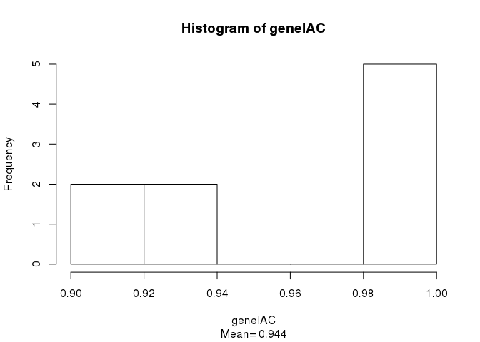
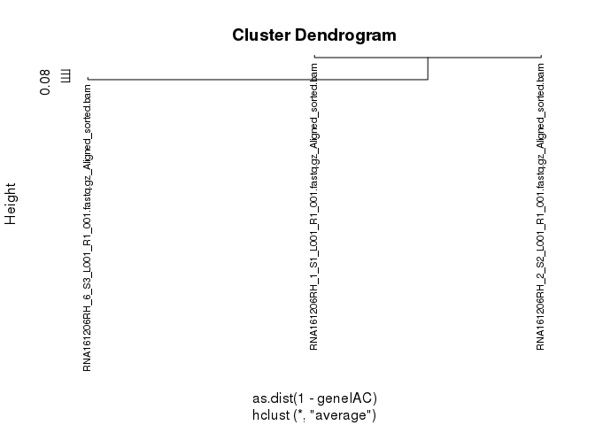
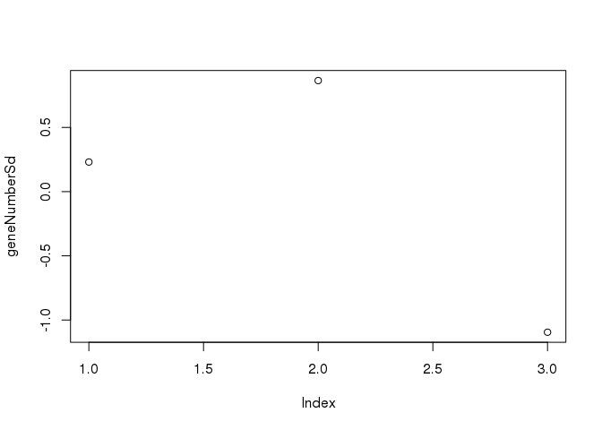

Normalization of reads for Synaptic Samples - RNA161206RH - Naive B6
================
Priscila Darakjian
1/30/2016

Description
-----------

This script normalizes coding exons and genes reads from RNA-Seq of 3 samples from synaptic tissue of the brain in Mus musculus.

#### Load libraries

``` r
library(matrixStats)
library(edgeR)
library(WGCNA)
```

    ## ==========================================================================
    ## *
    ## *  Package WGCNA 1.51 loaded.
    ## *
    ## *    Important note: It appears that your system supports multi-threading,
    ## *    but it is not enabled within WGCNA in R. 
    ## *    To allow multi-threading within WGCNA with all available cores, use 
    ## *
    ## *          allowWGCNAThreads()
    ## *
    ## *    within R. Use disableWGCNAThreads() to disable threading if necessary.
    ## *    Alternatively, set the following environment variable on your system:
    ## *
    ## *          ALLOW_WGCNA_THREADS=<number_of_processors>
    ## *
    ## *    for example 
    ## *
    ## *          ALLOW_WGCNA_THREADS=72
    ## *
    ## *    To set the environment variable in linux bash shell, type 
    ## *
    ## *           export ALLOW_WGCNA_THREADS=72
    ## *
    ## *     before running R. Other operating systems or shells will
    ## *     have a similar command to achieve the same aim.
    ## *
    ## ==========================================================================

``` r
library(biomaRt)
library(plotrix)

library(foreach)
library(doMC)
registerDoMC()
library(proxy)
library(sgof)
library(multtest)
library(plyr)

getDoParWorkers()
```

    ## [1] 36

``` r
options(cores = 16)
getDoParWorkers()
```

    ## [1] 16

``` r
setwd("/home/groups/rosalind/projects/RNA161206RH/161222_D00735_0165_BCAAF5ANXX")

source("scripts/functionDefinitions_selectNormalize.R")
source("scripts/functionDefinitions.R")
try(dir.create("data/resultsCoexpr"), silent = T)
try(dir.create("data/figuresCoexpr"), silent = T)
try(dir.create("data/resultsCoSplicEx"), silent = T)
try(dir.create("data/figuresCoSplicEx"), silent = T)

countsFile <- "data/RNA161206RH_coverage_splitoption_stranded_oppositeDirection.txt"
sampleNamesFile <- "data/bam_file_names.txt"
```

#### Data preparation

``` r
prepareCountsData(countsFile, sampleNamesFile)  # This may take a long time

load("data/gene_and_exon_counts.RData")
write.table(gene_counts, "data/RNA161206RH_mm10_gene_reads_not_normalized.txt", 
    sep = "\t", quote = F, col.names = NA, row.names = T)
write.table(exon_counts, "data/RNA161206RH_mm10_exon_reads_not_normalized.txt", 
    sep = "\t", quote = F, col.names = NA, row.names = T)
```

#### If you just need the normalized counts:

-   calculate edgeR normalization factors and normalize the data - use all data not just selected
-   these normalized data are not used for the DE analysis since edgeR's differential expression algorithm (used further down in this script) normalizes the data when calculating the DE

``` r
normalizeCounts(exon_counts, gene_counts)

load("data/normalizedCounts.RData")
write.table(normalizedGeneCountsUQ_genes, "data/RNA161206RH_mm10_gene_reads_UQnormalized.txt", 
    sep = "\t", quote = F, col.names = NA, row.names = T)
write.table(normalizedGeneCountsUQ_exons, "data/RNA161206RH_mm10_exon_reads_UQnormalized.txt", 
    sep = "\t", quote = F, col.names = NA, row.names = T)
```

##### Detect Sample Outliers (if any)

``` r
detectOutliers(gene_counts)

load("data/outlierSamples.RData")
hist(geneIAC, sub = paste("Mean=", format(mean(geneIAC[upper.tri(geneIAC)]), 
    digits = 3)))
```



``` r
plot(geneCluster, cex = 0.7, labels = dimnames(geneMatrixData)[[2]])
```



``` r
plot(geneNumberSd)
abline(h = -3)
```



``` r
geneOutliers
```

    ## character(0)

``` r
# Note: No outliers detected (n is also very small)
```
